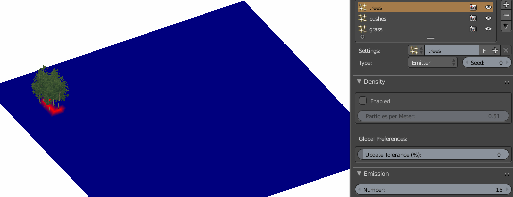
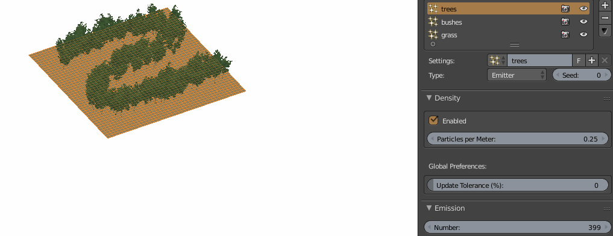
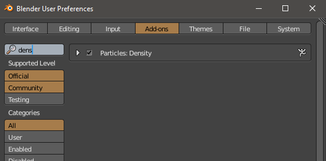

# Blender Particles Density
## A Blender 2.79 addon which adjusts the particles count to maintain the desired density

Blender is a nice tool for planting objects (like vegetation) using Particle System + Density Vertex Group, but the need of adjusting the particles count constantly as you progress with the scenery can become very confusing and time-consuming - the addon should solve this workflow limitation.

## Original Behavior
Normally, you set the total *Emmission Number* to get a density you are happy with. 
But as this is the constant number, the density gets lower as you Weight Paint more area (and vice-versa):

# Addon Behavior
With the addon, you set the *Density* parameter instead, and the *Emmission Number* is adjusted accordingly:

Additionally, even if you modify the *Emitter* mesh, the *Density* will keep the same:

### Installation
- Install it as an usual *Addon*, search for *Density* and enable it

- The new *Density* settings can be now found in a *Particle System* tab

### How to use it
- Each *Particle System* has now it's own *Density* settings (which can be *Enabled* or *Disabled*)
- Once you *Enable* the *Density*, the initial density value will be set automatically to match your current density (so it doesn't mess-up your work)
- The extra option *Update Tolerance* is an optimization feature and is useful when using high number of particles - it let's you set the minimum difference (in percentage) between the configured density and the current one, so it doesn't adjust the count constantly; it is a global option (*Addon Preference*), so it will keep the same for all your Blender projects

### Limitation
- The density expects an even mesh as it is currently computed on the overal mesh area, not the actual vertex group area (this is TODO)
- The addon should be very well optimized (I tested it on my very particle-heavy projects and made many performance-fixes), but the code is not exactly the most beautiful one and as my programming skills are not award-winning, there is maybe even hapenning something I am not aware of :)

**NOTE: Use at your own risk!**
Please be very careful when using the addon, nobody tested it extensively so far (except myself), so even though I haven't found any bugs, there are almost certainly some.
